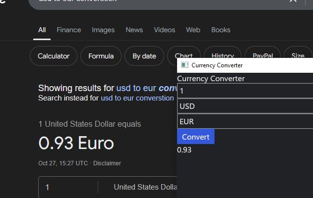
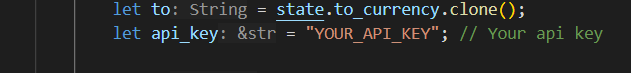

# Currency-converter

Simple currency convertor that gets, rates from public API (https://app.exchangerate-api.com). With gui from Gui library "iced".



# To run

Get custom API key form exchangerate.com, after paste in code as shown.



## Web Application

A simple Flask web application is included in `webapp/`. It provides:

- **Landing Page** (`/`)
- **Currency Conversion Page** (`/convert`)
- **Graph Page** (`/graph`)

### Setup

1. Install dependencies:

```bash
pip install -r webapp/requirements.txt
```

2. Run the application:

```bash
python webapp/app.py
```

The application will start on `http://127.0.0.1:5000/`.
